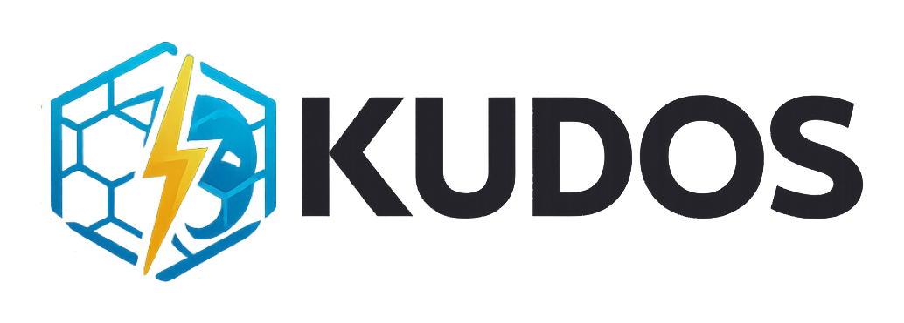
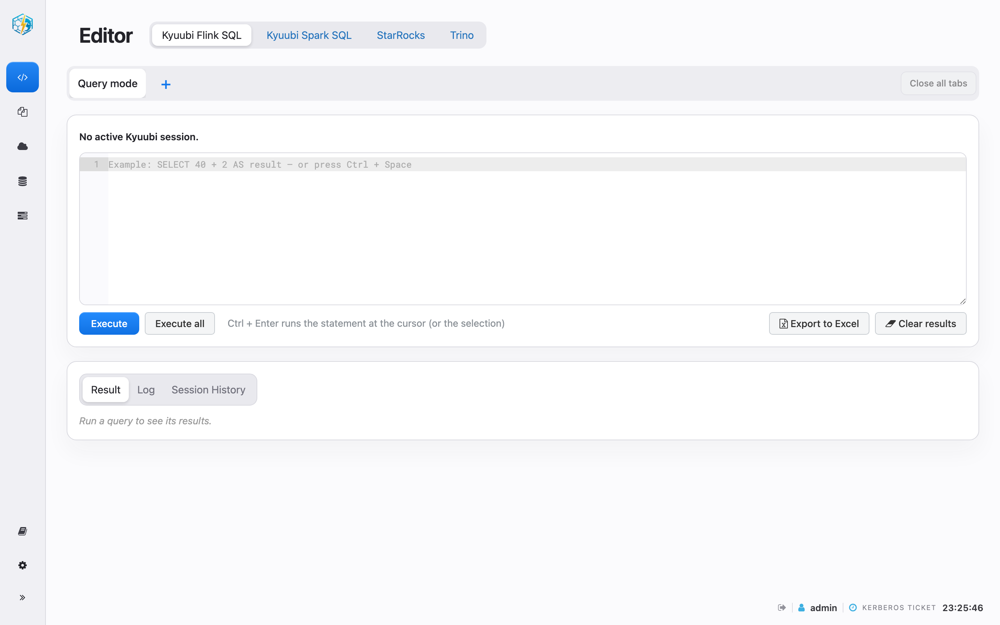
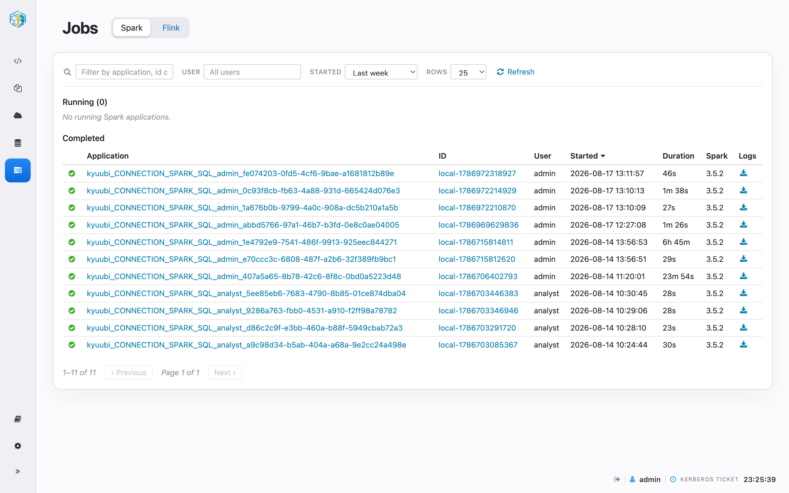
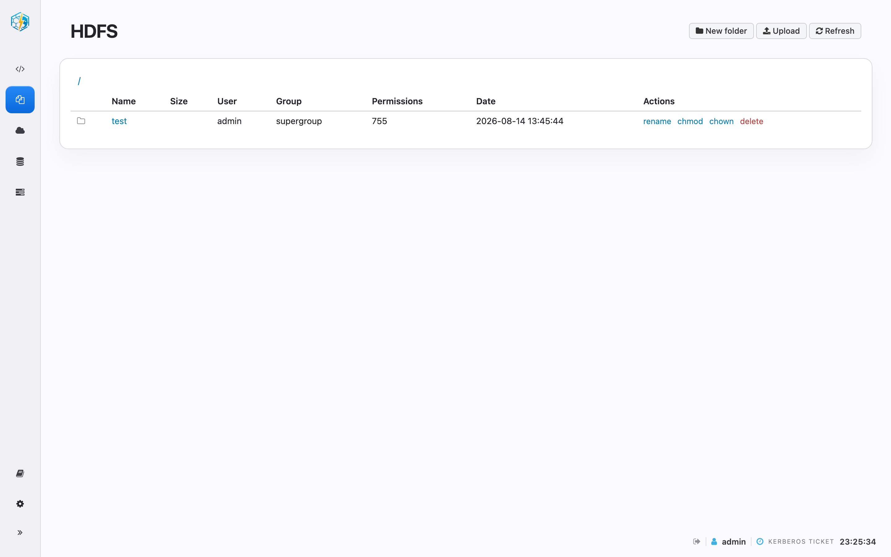
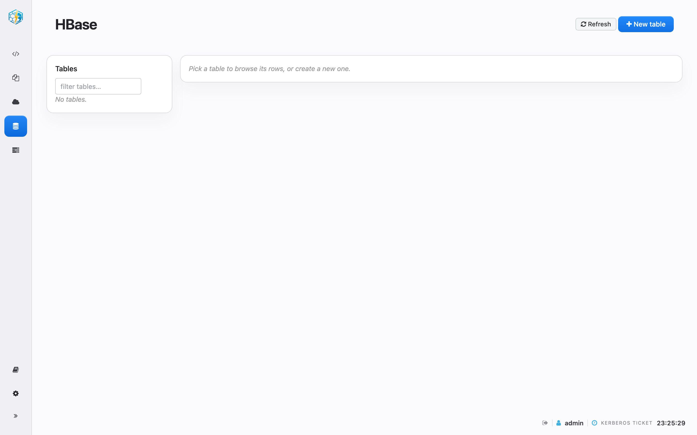
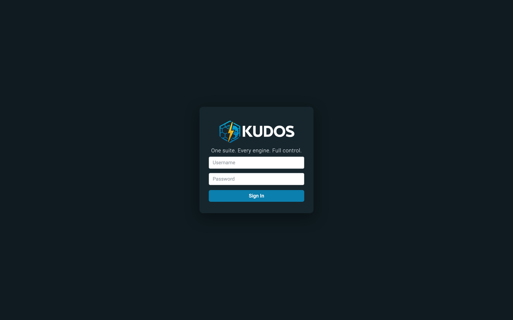

<div align="center">



### One suite. Every engine. Full control.

**KUDOS** — *Kubernetes Unified Data & Operations Suite*

[](LICENSE)


</div>

---

**KUDOS** is a single, self-service web console for a Kerberized big-data cluster —
an open, lightweight **alternative to Apache Hue**. Every action runs as the
signed-in user's own Kerberos identity, so access is decided by the underlying
services (HDFS, Ozone, HBase, Kyuubi), never by the UI.

## Why KUDOS

- **One place for everything** — SQL, files, tables and jobs across many engines, in a single UI.
- **Secure by design** — LDAP login plus per-user Kerberos tickets; the app holds no service keytab.
- **Lightweight** — a stateless Spring Boot app (Java 21) in a distroless container.
- **A modern Hue alternative** — the workflows Hue popularised, rebuilt on an independent, self-contained interface (no vendored Hue code).

## Features

**SQL Editor**
- Run SQL on **Kyuubi Spark SQL**, **Kyuubi Flink SQL**, **Trino** and **StarRocks** from one editor.
- Named Kyuubi sessions or per-query mode; **Result / Log / Session History** tabs; export to Excel.
- A shared **Iceberg lakehouse**: one Gravitino REST catalog over an Ozone S3 warehouse that all four engines read; a collapsible catalog panel lists its schemas and tables, click to insert.

**Data & storage**
- **Files** — browse HDFS over WebHDFS: navigate, preview, upload, manage permissions.
- **Ozone** — browse the Ozone `ofs://` object store.
- **HBase** — full table browser: create / alter / drop, scan with filters and pagination, edit rows and cells, bulk upload.

**Jobs**
- **Spark** and **Flink** applications on separate tabs, with the engine dashboards embedded (reverse-proxied) inside the KUDOS chrome.

**Administration & UX**
- LDAP roles are separated by responsibility: `administrator` manages the KUDOS platform, while `security-officer` can access only the `Security policies` center and their personal Light/Dark/System theme preference; tool pages and APIs are unavailable to that role.
- **Gravitino is the sole metadata and policy source for the lakehouse.** Ranger is not used: `admin` can access the full `catalog_iceberg`, while `analyst` can access only `iceberg.demo.customers`; integrations for the remaining tools are planned.
- Light, dark, and system themes with a collapsible sidebar.

## Screenshots

| SQL Editor | Jobs (Spark / Flink) |
| :---: | :---: |
|  |  |
| **Files — HDFS** | **HBase table browser** |
|  |  |

<div align="center">

</div>

## Quick start

A fully containerized, single-node Kerberos test cluster (FreeIPA, HDFS, Ozone,
HBase, Kyuubi, Trino, StarRocks) is included.

```bash
./dev/scripts/run-test-env.sh -d      # build and launch the test cluster
```

Then open `https://app.test.local:8443/` and sign in with the demo LDAP
credentials from the docs. Full setup, configuration and verification steps:
**[docs/README.md](docs/README.md)**.

For policy boundaries and the rollout plan, see the [centralized roles and policy model](docs/README.md).

## License

[Apache License 2.0](LICENSE) — © 2026 Aleksey Martynov and contributors.
